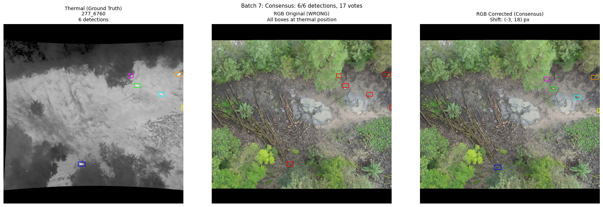
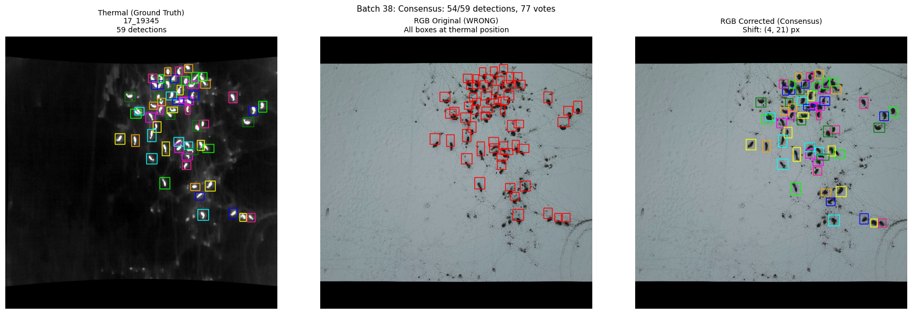
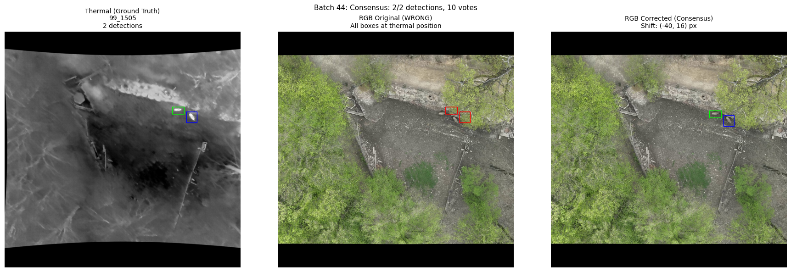
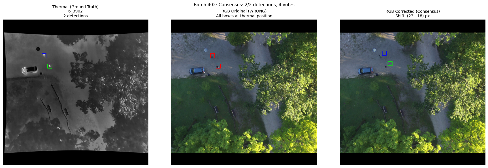

# 🔥 Thermal-RGB BBox Correction Toolkit

<p align="center">
  
  
  
</p>

<p align="center"><em>Examples of successful automatic bounding box corrections - Original (left) vs Corrected (right)</em></p>

A toolkit for correcting bounding box alignment between thermal and RGB aerial imagery. This tool addresses the common issue of misaligned annotations when projecting detections from thermal to RGB images due to camera calibration differences, parallax, and other factors.

## 🎯 The Problem

When working with synchronized thermal and RGB imagery from drones:
- Bounding boxes annotated on thermal images often don't align correctly when projected onto RGB images 
- This misalignment can be caused by camera positioning, lens differences, time synch, and projection errors
- Manual correction is time-consuming for large datasets

## ✨ The Solution

This toolkit provides two approaches:

1. **Automatic Batch Correction** (`correct_bboxes.py`) - Uses template matching with multiple preprocessing methods and consensus-based validation to automatically correct alignment
2. **Interactive Correction Tool** (`interactive_tool.py`) - A GUI-based tool for manual review and correction

## 📊 Results

In our testing on **406 samples**:
- ✅ **405/406 (99.75%)** showed improvement or no change
- ⚠️ **1/406 (0.25%)** showed degraded results

<p align="center">
  
</p>
<p align="center"><em>The single case (out of 406) where automatic correction produced worse results. Results may vary depending on your specific dataset.</em></p>

## 🚀 Quick Start

### Installation

```bash
# Clone the repository
git clone https://github.com/HugoMarkoff/BAMBI_BBox_Corrections.git
cd BAMBI_BBox_Corrections

# Install dependencies
pip install -r requirements.txt
```

### Requirements

- Python 3.8+
- OpenCV
- NumPy
- Pillow
- Matplotlib (for visualizations)
- Tkinter (usually included with Python)

## 📁 Data Structure

The toolkit supports **two label formats**: YOLO format (`.txt`) and JSON metadata format.

### Option 1: YOLO Format Labels

```
your_data/
├── thermal/              # Thermal images
│   ├── 152_14253.jpg
│   ├── 152_14273.jpg
│   └── ...
├── rgb/                  # RGB images (MUST match thermal image names)
│   ├── 152_14253.jpg
│   ├── 152_14273.jpg
│   └── ...
└── labels/               # YOLO format .txt files
    ├── 152_14253.txt
    ├── 152_14273.txt
    └── ...
```

**YOLO format** (normalized coordinates):
```
<class_id> <x_center> <y_center> <width> <height>
```

Example:
```
2 0.996582 0.841309 0.006836 0.041992
2 0.984375 0.902832 0.031250 0.026367
```

### Option 2: JSON Metadata Format

```
your_data/
├── thermal/              # Thermal images
│   └── ...
├── rgb/                  # RGB images
│   └── ...
└── metadata/             # JSON metadata files
    ├── 152_metadata.json
    └── ...
```

**Metadata JSON structure**:
```json
{
  "flight_key": "152",
  "frames": {
    "14253": {
      "thermal_image": "152_14253.jpg",
      "rgb_image": "152_14253.jpg",
      "annotations": [
        {
          "bbox": {
            "x_min": 654,
            "y_min": 273,
            "x_max": 717,
            "y_max": 318
          },
          "species": "Rotwild",
          ...
        }
      ]
    }
  }
}
```

## ⚠️ Important Notes

### Resolution Matching
- **Thermal and RGB images MUST have the same resolution** (e.g., both 640×512 or both upscaled to matching dimensions)
- If your original RGB images are higher resolution, resize them to match thermal resolution before correction
- The bounding box coordinates are based on pixel positions, so resolution mismatch will cause incorrect corrections

### File Naming
- Thermal and RGB images should have **matching filenames** (e.g., `152_14253.jpg` for both)
- YOLO labels should match image names with `.txt` extension

## 🔧 Usage

### Automatic Batch Correction

```bash
python correct_bboxes.py \
    --thermal-dir ./your_data/thermal \
    --rgb-dir ./your_data/rgb \
    --labels-dir ./your_data/labels \
    --output-dir ./output \
    --save-viz
```

**Arguments:**
| Argument | Description | Default |
|----------|-------------|---------|
| `--thermal-dir` | Path to thermal images directory | Required |
| `--rgb-dir` | Path to RGB images directory | Required |
| `--labels-dir` | Path to labels (YOLO .txt or JSON metadata) | Required |
| `--output-dir` | Output directory for corrected labels | `./output` |
| `--tolerance` | Pixel tolerance for clustering shifts (±N pixels) | `10` |
| `--min-consensus` | Minimum consensus score to accept correction | `0.4` |
| `--min-coverage` | Minimum fraction of detections that must agree | `0.67` |
| `--save-viz` | Save visualization samples | Flag |
| `--viz-interval` | Save visualization every N corrections | `100` |

### Interactive Correction Tool

```bash
python interactive_tool.py
```

This opens a GUI where you can:
1. Load thermal/RGB image pairs with their annotations
2. Visualize the current alignment
3. Manually adjust bounding box positions
4. Save corrections

## 📐 How It Works

### Template Matching with Multiple Methods

The automatic correction uses **template matching** with multiple image preprocessing methods:

1. **Grayscale** - Simple intensity matching
2. **CLAHE Contrast** - Contrast-enhanced matching
3. **Canny Edges** - Edge-based matching (robust to intensity differences)
4. **Adaptive Threshold** - Binary pattern matching
5. **LAB Luminance** - Color-space based matching

### Consensus-Based Validation

For frames with multiple bounding boxes:
1. Compute optimal shift for each bbox using all matching methods
2. Cluster similar shifts together
3. Select the shift with highest consensus (most methods + most bboxes agree)
4. Only apply correction if consensus exceeds threshold

This approach is robust because:
- Multiple animals in the same frame should have the **same** misalignment
- Using multiple matching methods reduces false positives
- Consensus validation catches edge cases

## 🧪 Testing with Sample Data

Sample data is included for testing:

```bash
# Test with included sample data
python correct_bboxes.py \
    --thermal-dir ./sample_data/thermal \
    --rgb-dir ./sample_data/rgb \
    --labels-dir ./sample_data/labels \
    --output-dir ./test_output \
    --save-viz
```

## 📂 Repository Structure

```
thermal-rgb-bbox-correction/
├── correct_bboxes.py        # Main automatic correction script
├── interactive_tool.py      # Interactive GUI tool
├── requirements.txt         # Python dependencies
├── README.md               # This file
├── src/                    # Core modules
│   ├── __init__.py
│   ├── correction_core.py  # Template matching engine
│   └── label_parsers.py    # YOLO and JSON parsers
├── sample_data/            # Sample data for testing
│   ├── thermal/
│   ├── rgb/
│   ├── labels/
│   └── metadata/
└── docs/
    └── assets/             # Documentation images
```

## 🔬 Algorithm Details

### Shift Computation

For each bounding box:
1. Extract the region from the thermal image
2. Define expanded search region in RGB image (3x bbox size)
3. Apply each preprocessing method to both regions
4. Use `cv2.matchTemplate` with `TM_CCOEFF_NORMED` to find best match
5. Compute pixel shift from original position to matched position

### Shift Clustering

```python
# Shifts within ±tolerance pixels are considered the same
cluster_shifts(shifts, tolerance=10)
```

### Consensus Score

```
score = (methods_agreeing / total_methods) × (bboxes_agreeing / total_bboxes)
```

A correction is applied only if `score >= min_consensus_score` and `bboxes_agreeing / total_bboxes >= min_coverage`.

## 🤝 Contributing

Contributions are welcome! Please feel free to submit a Pull Request.

## 📜 License

This project is licensed under the MIT License - see the [LICENSE](LICENSE) file for details.

## 🙏 Acknowledgments

- Developed for the BAMBI project for wildlife detection from aerial thermal imagery
- Uses OpenCV for image processing and template matching

## 📧 Contact

For questions or issues, please open a GitHub issue or contact the maintainers.
